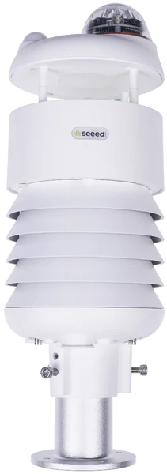
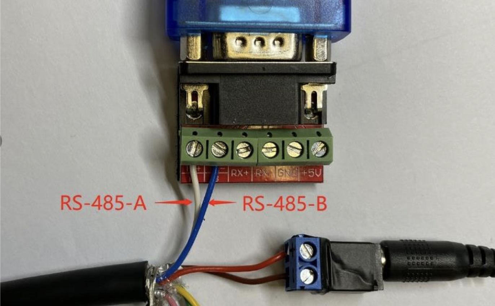

Authors: Yiwei Zhang, NAU IoT (Duane Booher, Jacob Hagan)

# Introduction 
This repository contains sample code to read and collect Seeed SenseCAP ONE S900 Compact Weather Station data within a Docker container. The purpose of this code is to support the Discover project at Northern Arizona University.

Users may use this code as a starting point for any experiments that may utilize the Seeed SenseCAP ONE S900 Compact Weather Station.

# Getting Started
The following steps outline the dependencies for the project and provide installation instructions to get the project running on a local device. 

## Hardware
The system that was used to host this project is a Raspberry Pi 3 Model B running Ubuntu Server 20.04, with a [Seeed SenseCAP ONE S900 Compact Weather Station](https://files.seeedstudio.com/products/101990784/SenseCAP%20ONE%20Compact%20Weather%20Sensor%20User%20Guide-v1.6.pdf) attached via USB using a [USB to RS485 Serial Port Converter Adapter Cable](https://www.amazon.com/Serial-Converter-Adapter-Supports-Windows/dp/B076WVFXN8/ref=asc_df_B076WVFXN8/?tag=hyprod-20&linkCode=df0&hvadid=309776868400&hvpos=&hvnetw=g&hvrand=15455232194279378143&hvpone=&hvptwo=&hvqmt=&hvdev=c&hvdvcmdl=&hvlocint=&hvlocphy=1013406&hvtargid=pla-486428615671&th=1).



*Figure 1: Seeed SenseCap ONE S900 Compact Weather Station.*



*Figure 2: Wiring demonstration for the RS-485 Serial Port Converter.*

## Installation process
Clone this repository:
```bash
git clone https://github.com/DiscoverCCRI/weather-station-test1.git
```

## Software dependencies
Since this is a container-based application, the only dependency is Docker. Use the apt package manager to install it:
```bash
sudo apt install docker.io
```
### As of 04/2023
Installing MariaDB 
```
$ sudo apt install wget
$ wget https://r.mariadb.com/downloads/mariadb_repo_setup
$ echo "ad125f01bada12a1ba2f9986a21c59d2cccbe8d584e7f55079ecbeb7f43a4da4  mariadb_repo_setup" | sha256sum -c -
$ chmod +x mariadb_repo_setup
$ sudo ./mariadb_repo_setup --mariadb-server-version="mariadb-10.6"
$ sudo apt install libmariadb3 libmariadb-dev
```

To install grafana (this installation follows ARM-based processors)
```
# install latest version of grafana
$ sudo wget https://dl.grafana.com/enterprise/release/grafana-enterprise_9.3.1_arm64.deb
# reload systemctl daemon
$ sudo /bin/systemctl daemon-reload
# enable grafana systemctl service
$ sudo /bin/systemctl enable grafana-server
# install elements
$ sudo dpkg -i grafana-enterprise_9.3.1_arm64.deb
```

Installing Python dependencies
```
# dependencies are housed within the requirements.txt file
$ pip install -r requirements.txt
```

## Latest releases
### Version 1.0
Currently, this program is Docker-based. Specifically, the weather-station-read.py program is the primary functional code and the weather station read interval is defined by a cron job. Assuming all instructions have been followed to run the applications (refer to 'Build and Test'), the weather station data will be stored in /data/weather-station-output.json. If a Docker volume is not mounted when running the image, weather station data will still be collected but will be stored in /weather-station-output.json. Keep in mind that if you do not use a volume, all of the data will be lost when the container is deleted.

Originally, this program was intended to publish weather station data over MQTT. Since then, there has been some reevaluation of the design and we have decided to make the MQTT communication an independent module (likely a Docker container). The original MQTT work is preserved in the [mqtt-test/](./mqtt-test/) directory with all dependent files.


# Build and Test
With the repo pulled down and Docker installed, we can begin building and running the application.

## Build the image
Navigate to the directory that the repository was cloned to and build the Docker image:
```bash
cd weather-station-test1
sudo docker build --rm -t weather-station-read .
```
* `--rm` : Remove intermediate containers after a successful build.
* `-t weather-station-read` : Assign a name to the Docker image that will be built.

## Run the container
This application requires a volume to be allocated in order to store weather station readings. Execute the following command:
```bash
sudo docker volume create experiment-data
```

Once the volume has been created, we can run the Docker container:
```bash
sudo docker run --device=/dev/ttyUSB0 -v experiment-data:/data -t -i -d weather-station-read
```
* `--device=/dev/ttyUSB0` : Gives the container permission to access to the weather station device.
* `-v experiment-data:/data` : Mounts the 'experiment-data' volume to '/data' in the container's file system.
* `-t` : Allocate a pseudo-tty.
* `-i` : Keep STDIN open even if not attached.
* `-d` : Start the container in detached mode.

View the newly created Docker container's ID and other info with the following command:
```bash
sudo docker ps
```

## Analyze output logs and data 
Now that the container is started, we can take a look at a few items. First, we will look at Docker logs, which is the output of `tail -f /var/log/cron.log`, as defined in the [Dockerfile](./Dockerfile).
```bash
sudo docker logs -f <CONTAINER ID>
```
* `-f` : Follow log output.

Which results in the following output after waiting about a minute:
```bash
[+] Creating /data/weather-station-output.json...
[+] The following data will stored: {'Temperature': '22.940', 'Humidity': '18.560', 'Pressure': '79310.000', 'Light Intensity': '645.000', 'Min Wind Direction': '0.000', 'Max Wind Direction': '0.000', 'AVG Wind Direction': '0.000', 'Min Wind Speed': '0.000', 'Max Wind Speed': '0.000', 'AVG Wind Speed': '0.000', 'Accum Rainfall': '0.200', 'Accum Rainfall Duration': '10.000', 'Rainfall Intensity': '0.000', 'Max Rainfall Intensity': '0.000', 'Heating Temperature': '22.780', 'The dumping of state': '0.000', 'PM2.5': '0.000', 'PM10': '0.000', 'timestamp': '2022-06-17 15:44:11 UTC'}
```

Since the collected data is being saved to a shared volume, we can either check out the data in the weather-station-read container or from a seperate container with the shared volume mounted to it. The weather-station-read container is already running, so we will check out the data from there:
```bash
sudo docker exec -it <CONTAINER ID> /bin/bash
```

At this point, you should be within the container's bash session. You should see `root@<CONTAINER ID>:/#` in your terminal. To see the gathered data, run the following command:
```bash
cat /data/weather-station-output.json
```

Which results in:
```json
[
    {
        "Temperature": "22.940",
        "Humidity": "18.560",
        "Pressure": "79310.000",
        "Light Intensity": "645.000",
        "Min Wind Direction": "0.000",
        "Max Wind Direction": "0.000",
        "AVG Wind Direction": "0.000",
        "Min Wind Speed": "0.000",
        "Max Wind Speed": "0.000",
        "AVG Wind Speed": "0.000",
        "Accum Rainfall": "0.200",
        "Accum Rainfall Duration": "10.000",
        "Rainfall Intensity": "0.000",
        "Max Rainfall Intensity": "0.000",
        "Heating Temperature": "22.780",
        "The dumping of state": "0.000",
        "PM2.5": "0.000",
        "PM10": "0.000",
        "timestamp": "2022-06-17 15:44:11 UTC"
    }
]
```

# Contribute
Here's a list of immediate improvements to be made:
1. Soon, we will be experimenting with Docker Compose with an MQTT container to deliver weather station updates over MQTT.
2. A lot of the functional code needs to be refactored to improve readability.
    * A note about this: There is a known read timeout error that is being worked on. A bug fix will come alongside the aforementioned refactor.

